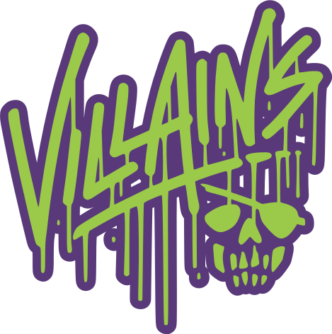

<p style="text-align: center;">
  
</p>

<h1 style="text-align: center;">Villains Vault</h1>

<p style="text-align: center;">
  <strong>Track, analyze, and celebrate your runDisney race achievements</strong>
</p>

<p style="text-align: center;">
  A full-stack application for runners to view their runDisney race results from Track Shack timing in one centralized location, with analytics and performance tracking across events.
</p>
<p style="text-align: center;">
  View the running application at <a href="https://vault.villains.run">https://vault.villains.run</a>.
</p>

<p style="text-align: center;">
  <a href="#features">Features</a> •
  <a href="#tech-stack">Tech Stack</a> •
  <a href="#getting-started">Getting Started</a> •
  <a href="#documentation">Documentation</a> •
  <a href="#contributing">Contributing</a> •
  <a href="#license">License</a>
</p>


---

## ✨ Features

- 🏃 **Centralized Race Results** - View all your runDisney race results in one place
- 📊 **Performance Analytics** - Track your progress across races and distances
- 🌐 **Cross-Platform** - Available on web, iOS, and Android
- 🎨 **Dark Mode Support** - Beautiful theme system with full dark mode
- 🔐 **Secure Authentication** - Social login with Google, Facebook, and Microsoft
- ⚡ **Real-time Updates** - Automatic syncing with Track Shack timing data
- 📱 **Responsive Design** - Optimized for all screen sizes
- 👑 **Admin Dashboard** - Manage events, races, and scraping jobs
- 🧑‍🤝‍🧑 **Community Events** - Create and join community-run events and challenges
- 🏅 **Claim and Follow Results** - Claim your races and follow other runners to see their achievements

## 🛠️ Tech Stack

### Frontend
- **React Native + Expo** - Cross-platform mobile and web development
- **Expo Router** - File-based navigation system
- **TypeScript** - Type-safe development
- **NativeWind** - Tailwind CSS styling for React Native
- **Auth0** - Social authentication provider

### Backend
- **.NET 10** - High-performance web API
- **Entity Framework Core** - ORM with SQL Server (LocalDB for development, Azure SQL for production)
- **JWT Authentication** - Secure API endpoints
- **OpenAPI/Swagger** - [Interactive API documentation](https://vault.villains.run/swagger)
- **Model Context Protocol (MCP)** - [Standardized API response format for seamless AI integration](docs/MCP_INTEGRATION.md)
- **Background Services** - Automated data scraping and synchronization

## 🚀 Getting Started

### Prerequisites

- **Node.js** 18 or higher
- **.NET 10 SDK**
- **Auth0 Account** - For authentication setup (free tier available)

### Quick Start

1. **Clone the repository**
   ```bash
   git clone https://github.com/glapointe/vault.git
   cd vault
   ```

2. **Set up the frontend**
   ```bash
   cd src/app
   npm install
   
   # Create .env.local with your Auth0 credentials
   cp .env.example .env.local
   # Edit .env.local with your Auth0 configuration
   
   # Start development server
   npm run web        # For web
   npm run ios        # For iOS (requires Xcode)
   npm run android    # For Android (requires Android Studio)
   ```

3. **Set up the backend**
   ```bash
   cd src/api/Falchion.Villains.Vault.Api
   dotnet restore
   
   # Update appsettings.Development.json with Auth0 credentials
   
   # Run the API
   dotnet run
   # API available at http://localhost:5000
   # Swagger UI at http://localhost:5000/swagger
   ```

4. **First Login**
   - The first user to authenticate automatically receives admin privileges
   - Use the admin dashboard to configure events and races

## 📚 Documentation

Detailed documentation is available in the `/docs` directory:

- **[Auth0 Setup Guide](docs/AUTH0_SOCIAL_SETUP.md)** - Configure social authentication
- **[Admin User Management](docs/ADMIN_USER_SETUP.md)** - User roles and permissions
- **[MCP Integration](docs/MCP_INTEGRATION.md)** - How the Model Context Protocol is implemented for AI integration
- **[Azure SQL to LocalDB Migration](docs/AZURE_SQL_TO_LOCALDB.md)** - Steps to migrate the database from Azure SQL to LocalDB for local development

## 🏗️ Architecture

This is a monorepo containing:

- **`src/app/`** - React Native frontend with Expo
- **`src/api/`** - .NET backend API

The application uses a modern, scalable architecture:
- Platform-specific authentication providers (web vs native)
- File-based routing with Expo Router
- Theme-aware component styling system
- Automatic user provisioning with first-user admin assignment


## 🧪 Testing

```bash
cd src/app

# Run tests
npm test

# Watch mode for development
npm test:watch

# Generate coverage report
npm test:coverage
```

## 🤝 Contributing

We welcome contributions! Here's how to get started:

1. **Fork the repository**
2. **Create a feature branch** (`git checkout -b feature/amazing-feature`)
3. **Make your changes**
   - Follow the existing code style (tabs for indentation)
   - Add JSDoc comments for new functions and components
   - Write tests for new features
   - Use TypeScript with proper typing
4. **Commit your changes** (`git commit -m 'Add amazing feature'`)
5. **Push to your branch** (`git push origin feature/amazing-feature`)
6. **Open a Pull Request**

### Development Guidelines

- **Code Style**: Use tabs for indentation, comprehensive JSDoc comments
- **Theme System**: Use design tokens from `theme/index.ts` for consistent styling
- **TypeScript**: Maintain strict type checking throughout the codebase
- **Documentation**: Update docs when adding new features or changing behavior

## 🐛 Bug Reports & Feature Requests

Found a bug or have an idea for a new feature? 

- **Bug Reports**: Please include steps to reproduce, expected behavior, and actual behavior
- **Feature Requests**: Describe the feature and why it would be useful

Open an issue on GitHub with the appropriate label.

## 📝 About runDisney

runDisney organizes race weekends throughout the year at Disney theme parks, offering distances from 5Ks to full marathons. Runners can earn unique Disney-themed medals and experience running through the parks. This application focuses on timed events (10k, half marathon, full marathon) from both Walt Disney World in Florida and Disneyland in California.

All race results are sourced from **Track Shack**, the official timer for runDisney events.

## 📄 License

This project is licensed under the Villains Vault Source Available License - see the [LICENSE](LICENSE) file for details. Individual components may be used for personal and educational purposes; commercial use and full application deployment are prohibited without permission.

## 🙏 Acknowledgments

- **runDisney** - For creating amazing race experiences
- **Track Shack** - For providing race timing services
- **Auth0** - For authentication infrastructure
- **Expo Team** - For the excellent React Native framework

---

<p align="center">
  Made with ❤️ for the runDisney community
</p>
